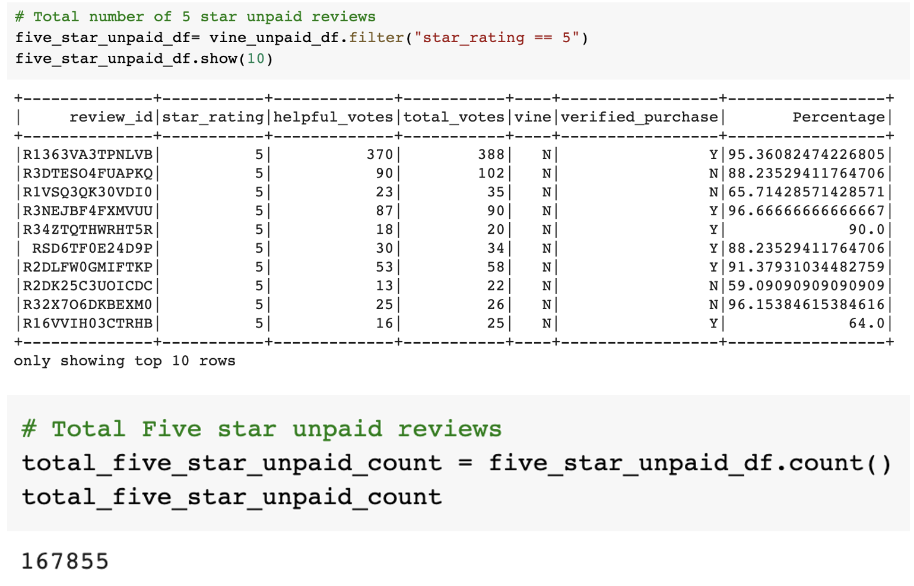

# Amazon_Vine_Analysis

Analysis of Big Data using AWS and PostgresSQL

## Overview of the analysis of the Vine program:

The purpose of this project was to conduct a meta-analysis of Amazon reviews. Specifically it was to analyze reviews produced as part of the Amazon Vine program. Amazon Vine is based on unbiased communication between selected reviewers (Vine Voices), enrolled sellers, and buyers. Sellers enroll in the program and submit products to be reviewed by Vine Voices. The goal is to provide customers with reliable feedback by using reviewers with a high “reviewer rank,” meaning they submit frequent, honest feedback that other buyers consider helpful.The cost of being a Vine Voice reviewer has always been free, aside from some tax burdens on products received, and there is no compensation for participants’ time. They receive “payment” in the form of free or discounted products to review. The primary goal of this project is to determine if there is any bias towards favorable reviews from the paid Vine members in the available data.

## Method:

Out of the 50 datasets of product categories available to chose from, I decided to analyze reviews in the Books category.
* url = "https://s3.amazonaws.com/amazon-reviews-pds/tsv/amazon_reviews_us_Books_v1_01.tsv.gz"

Reviews are a good indicator of a book's quality, meaning, and significance. Book reviews help spread the word and create a buzz about their book. Reviews also get the word out about the author, thus encouraging readers to read more of their works. The initial ETL portion of the project was conducted using AWS, PostgreSQL, and PySpark in Google Colab. The data analysis segment was conducted using PySpark and Google Colab.

## Results: 

Initially, a vine dataframe was created including the columns that are necessary for the analysis to compare if there is any bias towards favorable reviews from the paid Vine members in the given data.

### Number of Vine reviews and non-Vine reviews.

* The total number of vine reviewers with a vote percentage of above 50% is found to be 4743.

* The total number of non-vine reviewers with a vote percentage of above 50% is found to be 328313.

### Number of vine and non-vine reviewers with 5 star reviews.

* The total number of vine reviewers having a vote percentage of above 50% and who gave a 5 star review are 1604.

* The total number of non-vine reviewers having a vote percentage of above 50% and who gave a 5 star review are 167855.

### Percentage of Vine reviews and non-Vine reviews that are 5 stars.

* The percentage of vine reviewers with 5 star reviews is 33.82%
* The percentage of non-vine reviewers with 5 star reviews is 51.13%

## Summary:

Analyzing the above dataset on book reviews by vine and non-vine book reviewers, we can conclude by saying that there is no bias toward favorable reviews from Vine members in your dataset. We can rightfully say there is no bias because

* The total number of non-vine reviewers (328313) are way more than vine reviewers(4743).
* The total number of 5 stars given by non-vines reviewers are more than the the vine reviewers.
* The percentage of non-vine reviewer is 51.13% which is higher than the vine reviewers, which is 33.82%.

### Another interesting aspect from the dataset

* An interesting aspect to look into the dataset is among vine and non-vine reviewers how many have purchased the book. This can be achieved by filtering verified_purchase ==Y.

* The total number of paid vine reviewers who purchased their book is 29.
* The total number of unpaid vine reviewers who purchased their book is 55106.
* The unpaid vine reviewers bought their books more as compared to the paid vine reviewers.
The above analysis will provide a good insight to the SellBy stakeholders.

